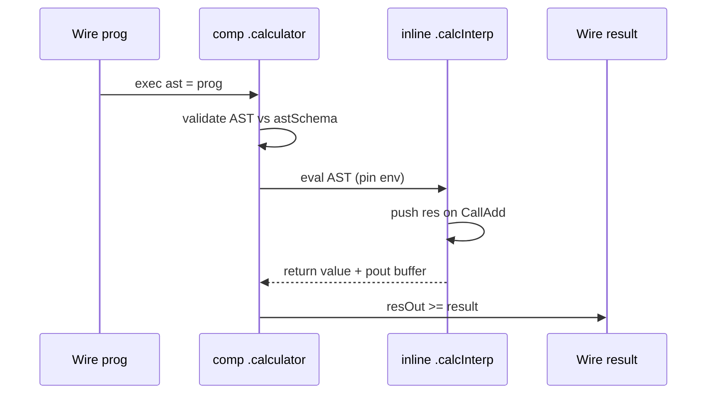

# Component interpreter — `comp [interp]`

`comp [interp]` is the **runtime layer** for evaluating typed AST wires with optional **pout buffering** (`push`, `remove`, `removeall`). It links an `inline [interp]` program, accepts an AST wire in the exec block, reads **pin** inputs, and redirects **pout** channels to LogTScript wires.

Method definitions and `/type` decode → [inline-interp.md](inline-interp.md). Parser and schemas → [inline-parser.md](inline-parser.md), [semantic-schemas.md](semantic-schemas.md).

> **Development feature:** `inline [parser]`, `inline [interp]`, and `comp [interp]` are available for experimentation in current builds. They are **not** part of the production language surface yet.

### Running examples (Load / Load & Run)

Runnable blocks on this page use the `logts-play` format. Each block shows two buttons in the documentation viewer:

| Button | What it does |
|--------|----------------|
| **Load** | Copies the script into the editor **without** running it. Inspect or edit the example, then press toolbar **RUN** when ready. |
| **Load & Run** | Copies the script and runs it immediately — check the **Output** panel for `show` results. |

Use **`on: 1`** on the component so the first run executes when **`set = 1`**.

---

## Quick reference

| Topic | Summary |
|-------|---------|
| **Role** | Evaluate AST wires on a trigger; optional side outputs via `push` |
| **Link** | **Required** `.calcInterp { }` (exactly one `inline [interp]`) |
| **Schema** | `astSchema = .program` — default schema when `ast = wire` has no typed suffix |
| **Exec** | `.calc:{ ast = prog, limitIn = lw, resOut >= result, set = run }` |
| **AST assign** | `ast = progWire` — wire must match schema; validated before eval |
| **Pins** | `pin limit/s32 as limitIn` — decoded to JS values in method env |
| **Pouts** | `pout res/s16 as resOut` — `resOut >= wire` redirect after exec |
| **Buffer ops** | `push res: expr`, `remove res`, `removeall` — **comp context only** |
| **`:eval` rule** | Inline with `push`/`remove` cannot use `.calcInterp:eval` — use `comp [interp]` |
| **Doc** | `doc(comp.interp)`, `doc(.calculator)` |

---

## Pipeline

```text
inline [parser] .calcLang     →  packAst / parse → typed AST wire
inline [interp] .calcInterp   →  Call* methods (+ push/remove in comp context)
comp [interp] .calculator     →  ast = wire, pins, pouts, set trigger
script wires                  →  result, limitWire, run
```



| Step | Where | What happens |
|------|-------|--------------|
| 1 | **Header** | `astSchema`, `.calcInterp { }`, `pin` / `pout` declarations |
| 2 | **Exec block** | Wire assigns pins; **`ast = …`** supplies AST bits |
| 3 | **Validation** | AST checked against schema — `ast binary is invalid for schema …` on failure |
| 4 | **Trigger** | Active **`set`** runs one eval pass |
| 5 | **Buffer** | `push` encodes pout values; `remove` drops pending channel without writing |
| 6 | **Redirect** | Committed pout channels write to `poutAlias >= wire` targets |

---

## Declaration

```logts-play
<byte>:
    value: 8
:

<symbol>+:
    bytes: bound <byte>[1-]
:

<CallNumber>:
    value: 8
:

<CallAdd>:
    left:  bound <expr>
    right: bound <expr>
:

<CallMul>:
    left:  bound <expr>
    right: bound <expr>
:

<CallVariable>:
    name: bound <symbol>
:

<expr>+:
    CallNumber?:   <CallNumber>
    CallAdd?:      bound <CallAdd>
    CallMul?:      bound <CallMul>
    CallVariable?: bound <CallVariable>
:

<CallAssign>:
    name:  bound <symbol>
    value: bound <expr>
:

<CallStatement>+:
    CallAssign?: bound <CallAssign>
:

<program>+:
    statements: bound <CallStatement>[1-]
:

inline [parser] .calcLang:
    token INT = [0-9]+;
    token ID  = [a-zA-Z_][a-zA-Z0-9_]*;
    rule program = statement+;
    rule statement = $name:ID "=" $value:expression ";" -> CallAssign;
    rule expression = expression "+" term -> CallAdd | term;
    rule term = term "*" factor -> CallMul | factor;
    rule factor = "(" expression ")" | INT -> CallNumber | $name:ID -> CallVariable;
:

inline [interp] .calcInterp {
    CallNumber(value/u8) {
        return value;
    }
    CallAdd(left/s16, right/s16) {
        push res: left + right;
        return left + right;
    }
    CallMul(left/s16, right/s16) {
        push res: left * right;
        return left * right;
    }
    CallAssign(name/ascii, value/s16) {
        env[name] = value;
        return value;
    }
    CallVariable(name/ascii) {
        return env[name];
    }
}

comp [interp] .calculator:
    on: 1
    astSchema = .program
    .calcInterp { }
    pin limit/s32 as limitIn
    pout res/s16 as resOut
    :

165wire<program> prog = .calcLang:packAst("x=1+2;", <program>, "program")
16wire result = 0000000000000000
32wire limitWire = 00000000000000000000000000000000
1wire run = 1

.calculator:{
    ast = prog
    limitIn = limitWire
    resOut >= result
    set = run
}

show(result)
```

**Load & Run** → **`result`** = `0000000000000011` (1+2 = 3). The **`push res:`** in `CallAdd` writes the sum to **`resOut`**, redirected to **`result`**.

---

## Header attributes

| Attribute | Description |
|-----------|-------------|
| **`on:`** | Trigger mode for **`set`** (`0`, `1`, `raise`, `edge`, …) — same family as other components |
| **`astSchema = .name`** | Default schema for **`ast = wire`** when the wire has no `<schema>` tag |
| **`.module { }`** | **Required** link to exactly one `inline [interp]` instance |
| **`pin ch/type as alias`** | Input pin — decoded per `/type` into the method environment under **`alias`** |
| **`pout ch/type as alias`** | Output channel — use **`alias >= wire`** in the exec block |

Pin/pout channel names (`limit`, `res`) are used in **`push res:`** / **`remove res`**. Exec-block aliases (`limitIn`, `resOut`) wire to script nets.

Vector pin/pout forms mirror `inline [interp]` (`[]/type`, `[N]/type`, `[N]M/ascii`, `[]~/ascii`). Decode on **pin** and encode on **`push`** use the same rules as [inline-interp.md](inline-interp.md) vector parameters.

| Notation | Meaning |
|----------|---------|
| **`pin ch[]/type as alias`** | Variable-length vector (wire must be a vector net, e.g. `16wire[5]`) |
| **`pin ch[N]/type as alias`** | Fixed **N** elements — wire width must be **N × elemWidth** when known at elaboration |
| **`pin ch[N]M/ascii as alias`** | **N** fixed strings of **M** characters each — `\0` bytes inside a slot are **literal** (not delimiters) |
| **`pin ch[]~/ascii as alias`** | Null-delimited ASCII blob on a **scalar** wire (`str0\0str1\0…`) |
| **`pin ch[N]~/ascii as alias`** | Null-delimited blob; decode returns the first **N** strings |

**Elaboration:** when a pin/pout is wired to a net whose width is known, fixed-count forms must match exactly (e.g. `pin data[4]3/ascii` → **96** bits on a `24wire[4]` net). Scalar/vector shape must match except **`~/ascii`**, which uses a scalar blob wire. Mismatch → elaboration error before run.

---

## Exec block

```logts
.calculator:{
    ast = progAst
    limitIn = limitWire
    resOut >= result
    set = run
}
```

| Property | Direction | Notes |
|----------|-----------|-------|
| **`ast = expr`** | in | AST wire bits; schema from wire tag, `parseAstSchemaRef`, or `astSchema` |
| **`pinAlias = expr`** | in | Assigns pin storage before eval |
| **`poutAlias >= wire`** | out | Redirect after exec — only channels **committed** by `push` update the wire |
| **`set = expr`** | trigger | When active (per **`on:`**), runs eval once |

### AST validation

If the AST bits do not match the resolved schema, exec reports:

```text
Error: ast binary is invalid for schema program: …
```

---

## push / remove / removeall

These statements are allowed **only** inside `inline [interp]` methods that run under **`comp [interp]`** (not under **`.calcInterp:eval`**).

| Statement | Effect |
|-----------|--------|
| **`push res: expr`** | Encode **`expr`** into pout channel **`res`** (pending until exec finishes) |
| **`remove res`** | Drop pending **`res`** — **does not** overwrite the redirected wire |
| **`removeall`** | Clear all pending pout entries |

### Precedence: `1+2*3`

```logts-play
165wire<program> prog = .calcLang:packAst("x=1+2*3;", <program>, "program")
16wire result = 0000000000000000
1wire run = 1

.calculator:{
    ast = prog
    resOut >= result
    set = run
}

show(result)
```

Expected: **`0000000000000111`** (7).

### remove keeps the previous wire value

```logts-play
<byte>:
    value: 8
:

<symbol>+:
    bytes: bound <byte>[1-]
:

<CallNumber>:
    value: 8
:

<expr>+:
    CallNumber?: <CallNumber>
:

inline [parser] .calcLang:
    token INT = [0-9]+;
    rule expression = INT -> CallNumber;
:

inline [interp] .calcRm {
    CallNumber(value/u8) {
        push res: value;
        remove res;
        return value;
    }
}

comp [interp] .calcRmComp:
    on: 1
    astSchema = .expr
    .calcRm { }
    pout res/s16 as resOut
    :

9wire<expr> ast = .calcLang:packAst("5", <expr>, "expression")
16wire result = 0000000000001111
1wire run = 1

.calcRmComp:{
    ast = ast
    resOut >= result
    set = run
}

show(result)
```

Expected: **`result`** stays **`0000000000001111`** — `remove res` cancels the push.

---

## Parse wire → AST → comp

Use **`.calcLang:parse`** and read **`pr:ast`** instead of `packAst` when the AST should come from the parse envelope:

```logts-play
4096wire<parseResult> pr =: .calcLang:parse("x=3+4;", <program>, "program")
165wire<program> progAst = pr:ast
16wire result = 0000000000000000
32wire limitWire = 00000000000000000000000000000000
1wire run = 1

.calculator:{
    ast = progAst
    limitIn = limitWire
    resOut >= result
    set = run
}

show(result)
```

Expected: **`0000000000000111`** (3+4 = 7). Declare **`progAst`** at the packed AST width (here **165** bits for this program).

---

## Two assignments via env

Program with two statements — the last **`push res`** wins on a single pout channel:

```logts-play
<byte>:
    value: 8
:

<symbol>+:
    bytes: bound <byte>[1-]
:

<CallNumber>:
    value: 8
:

<CallAdd>:
    left:  bound <expr>
    right: bound <expr>
:

<CallMul>:
    left:  bound <expr>
    right: bound <expr>
:

<CallVariable>:
    name: bound <symbol>
:

<expr>+:
    CallNumber?:   <CallNumber>
    CallAdd?:      bound <CallAdd>
    CallMul?:      bound <CallMul>
    CallVariable?: bound <CallVariable>
:

<CallAssign>:
    name:  bound <symbol>
    value: bound <expr>
:

<CallStatement>+:
    CallAssign?: bound <CallAssign>
:

<program>+:
    statements: bound <CallStatement>[1-]
:

inline [parser] .calcLang:
    token INT = [0-9]+;
    token ID  = [a-zA-Z_][a-zA-Z0-9_]*;
    rule program = statement+;
    rule statement = $name:ID "=" $value:expression ";" -> CallAssign;
    rule expression = expression "+" term -> CallAdd | term;
    rule term = term "*" factor -> CallMul | factor;
    rule factor = "(" expression ")" | INT -> CallNumber | $name:ID -> CallVariable;
:

inline [interp] .calcInterp {
    CallNumber(value/u8) { return value; }
    CallAdd(left/s16, right/s16) {
        push res: left + right;
        return left + right;
    }
    CallMul(left/s16, right/s16) {
        push res: left * right;
        return left * right;
    }
    CallAssign(name/ascii, value/s16) {
        env[name] = value;
        push res: value;
        return value;
    }
    CallVariable(name/ascii) { return env[name]; }
}

comp [interp] .calculator:
    on: 1
    astSchema = .program
    .calcInterp { }
    pout res/s16 as resOut
    :

330wire<program> prog = .calcLang:packAst("a=2+3;b=4*5;", <program>, "program")
16wire sumA = 0000000000000000
1wire run = 1

.calculator:{
    ast = prog
    resOut >= sumA
    set = run
}

show(sumA)
```

Expected: **`0000000000000101`** (last **`push res`** from `b=4*5` — the final statement value). For per-assignment taps, use separate pout channels or multiple exec passes.

---

## push / remove and inline :eval

If an `inline [interp]` uses **`push`**, **`remove`**, or **`removeall`**, **`.calcInterp:eval(ast, <schema>)`** is rejected:

```text
Error: .calcInterp:eval cannot run inline with push/remove (use comp [interp])
```

Use **`comp [interp]`** for buffered side outputs.

---

## Vector pin / pout

Extended pin/pout notation matches `inline [interp]` vector parameters. **Load** or **Load & Run** on the examples below.

### Fixed `[N]/u16` pin — sum five values

```logts-play
<F4aPing>+:
    dummy: 8
:

inline [interp] .f4aVec {
    F4aPing(dummy/u8) {
        total = 0;
        i = 0;
        while (i < vectorLen(valsIn)) {
            total = total + valsIn[i];
            i = i + 1;
        }
        push res: total;
        return total;
    }
}

comp [interp] .f4aU16Comp:
    on: 1
    astSchema = .F4aPing
    .f4aVec { }
    pin vals[5]/u16 as valsIn
    pout res/u16 as resOut
    :

8wire<F4aPing> ast = 00000000
16wire[5] valsWire = 0000000000000001 + 0000000000000010 + 0000000000000011 + 0000000000000100 + 0000000000000101
16wire result = 0000000000000000
1wire run = 1

.f4aU16Comp:{
    ast = ast
    valsIn = valsWire
    resOut >= result
    set = run
}

show(result)
```

Expected: **`result`** = `0000000000001111` (1+2+3+4+5 = 15). Pin **`vals[5]/u16`** requires a **vector** wire (`16wire[5]`); wire width must be **80** bits at elaboration.

### `[2]10/ascii` pin → pout round-trip

Each element is **exactly 10 characters** (NUL bytes inside a slot are literal, not delimiters).

```logts-play
<F4aPing>+:
    dummy: 8
:

inline [interp] .f4aStr {
    F4aPing(dummy/u8) {
        push strOut: dataIn;
        return vectorLen(dataIn);
    }
}

comp [interp] .f4aStrComp:
    on: 1
    astSchema = .F4aPing
    .f4aStr { }
    pin strIn[2]10/ascii as dataIn
    pout strOut[2]10/ascii as dataOut
    :

8wire<F4aPing> ast = 00000000
80wire[2] dataWire = 00110000001100010011001000110011001101000011010100110110001101110011100000111001 + 01100001011000100110001101100100011001010110011001100111011010000110100101101010
80wire[2] outWire = 0000000000000000000000000000000000000000000000000000000000000000000000000000000000000000000000000000000000000000000000000000000000000000000000000000000000000000
1wire run = 1

.f4aStrComp:{
    ast = ast
    dataIn = dataWire
    dataOut >= outWire
    set = run
}

show(outWire)
```

Expected: **`outWire`** matches **`dataWire`** (160 bits total on two 80-bit elements).

### Null-delimited `[]~/ascii`

Uses a **scalar** blob wire (`str0\0str1\0…`). A single trailing `\0` after the last string does not add an extra empty element.

```logts-play
<F4aPing>+:
    dummy: 8
:

inline [interp] .f4aNull {
    F4aPing(dummy/u8) {
        push tagOut: tagsIn;
        push res: vectorLen(tagsIn);
        return vectorLen(tagsIn);
    }
}

comp [interp] .f4aNullVarComp:
    on: 1
    astSchema = .F4aPing
    .f4aNull { }
    pin tagIn[]~/ascii as tagsIn
    pout tagOut[]~/ascii as tagsOut
    pout res/u16 as resOut
    :

8wire<F4aPing> ast = 00000000
104wire tagsWire = 01100011011001010111011001100001000000000000000001100001011011000111010001100011011001010111011001100001
104wire tagsOutWire = 00000000000000000000000000000000000000000000000000000000000000000000000000000000000000000000000000000000
16wire result = 0000000000000000
1wire run = 1

.f4aNullVarComp:{
    ast = ast
    tagsIn = tagsWire
    tagsOut >= tagsOutWire
    resOut >= result
    set = run
}

show(result)
show(tagsOutWire)
```

Expected: **`result`** = `0000000000000011` (three strings: `ceva`, empty, `altceva`); **`tagsOutWire`** equals **`tagsWire`**.

### Elaboration width check

```logts
comp [interp] .f4aBadComp:
    pin data[4]3/ascii as dataIn
    ...
24wire[2] bad = ...
.f4aBadComp:{ dataIn = bad ... }
```

Elaboration error — pin needs **96** bits (`4 × 3 × 8`), wire has **48**.

---

## Missing inline link

```logts
comp [interp] .bad:
    astSchema = .program
    :
```

Elaboration error — **`calcInterp`** link required (e.g. **`.calcInterp { }`**).

---

## Related pages

- [inline-interp.md](inline-interp.md) — method syntax, `/type`, vectors, `:eval`
- [inline-parser.md](inline-parser.md) — `packAst`, `parse`, `parseResult`
- [semantic-schemas.md](semantic-schemas.md) — schema layout and union tags
- [comp-logic.md](comp-logic.md) — similar comp exec / redirect pattern for logic
